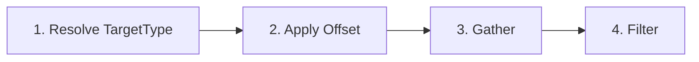

# Diesel Targeting Architecture

## Design Principles

1. **Backends own the type aliases.** Users never write `Target<Vec3>` or `GoOff<Vec3>`. They import from their backend's prelude and write `Target`, `GoOff`, `TargetMutator`, etc. Diesel core's generic types are implementation details.
2. **Post-gather filtering is fully extensible.** Team filtering and count limiting are NOT hardcoded pipeline stages. They are utility types/functions that backends can compose into their own `Filter` associated type. A backend can add line-of-sight raycasting, priority scoring, or any other custom pruning step.
3. **Diesel core orchestrates, backends specialize.** The core defines the pipeline shape (resolve -> offset -> gather -> filter) and provides the orchestration logic. Backends fill in the spatial math and filtering strategy.

## Pipeline Overview




- **Stage 1 (Resolve):** Core logic. Resolves `TargetType` (Invoker, Root, Passed, etc.) to a base `Target<P>` using a `position_of` closure.
- **Stage 2 (Offset):** Backend logic. Delegates to `B::apply_offset`.
- **Stage 3 (Gather):** Backend logic. Delegates to `find_entities` closure or `B::generate_position`.
- **Stage 4 (Filter):** Backend logic. Delegates to `B::apply_filter`. Backend composes diesel utility functions (team filter, count limit, sort by distance) with any custom filters (line-of-sight, priority, etc.).

Stages 1 is universal. Stages 2-4 are backend-specific. Diesel orchestrates all four but only implements stage 1 directly.

## SpatialBackend Trait

A marker trait with associated types. No SystemParam bounds -- the backend is a type-level configuration, not a runtime resource.

```rust
pub trait SpatialBackend: Send + Sync + 'static {
    /// The position representation (Vec3, Vec2, IVec2, usize, etc.)
    type Pos: Clone + Copy + Send + Sync + Default + Debug + 'static;
    /// Backend-specific offset configuration
    type Offset: Clone + Send + Sync + Default + 'static;
    /// Backend-specific gatherer configuration
    type Gatherer: Clone + Send + Sync + Default + 'static;
    /// Backend-specific post-gather filter configuration
    type Filter: Clone + Send + Sync + Default + 'static;

    fn apply_offset(
        pos: Self::Pos,
        offset: &Self::Offset,
        rng: &mut dyn RngCore,
    ) -> Self::Pos;

    fn generate_position(
        origin: Self::Pos,
        gatherer: &Self::Gatherer,
        rng: &mut dyn RngCore,
    ) -> Self::Pos;

    fn distance(a: &Self::Pos, b: &Self::Pos) -> f32;
}
```

## Backend-Defined Types (example: avian3d)

Each backend defines its own offset, gatherer, and filter enums:

```rust
pub struct AvianBackend;

pub enum Vec3Offset {
    None,
    Fixed(Vec3),
    RandomBetween(Vec3, Vec3),
    RandomInSphere(f32),
    RandomInCircle(f32),
}

pub enum AvianGatherer {
    None,
    Sphere(f32),
    Circle(f32),
    Box(Vec3),
    Line { direction: Vec3, length: f32 },
    EntitiesInRadius(f32),
    NearestEntities(f32),
    AllEntitiesInRadius(f32),
    SpecificEntity,
}

pub struct AvianFilter {
    pub team: Option<TeamFilter>,       // diesel utility type
    pub count: Option<NumberType>,      // diesel utility type
    pub line_of_sight: bool,            // backend-specific
}
```

Contrast with a hypothetical grid backend:

```rust
pub struct GridBackend;

pub enum GridOffset {
    None,
    Fixed(IVec2),
    RandomInRange(i32),
}

pub enum GridGatherer {
    ManhattanRadius(i32),
    ChebyshevRadius(i32),
    SpecificEntity,
}

pub struct GridFilter {
    pub team: Option<TeamFilter>,
    pub count: Option<NumberType>,
    pub require_walkable: bool,         // grid-specific
}
```

## Backend Type Aliases

The backend crate exports type aliases so users never touch generics. This is a **first-class design requirement**, not an afterthought.

```rust
// In bevy_diesel_avian3d::prelude

pub type Target = diesel::Target<Vec3>;
pub type GoOff = diesel::GoOff<Vec3>;
pub type TargetGenerator = diesel::TargetGenerator<AvianBackend>;
pub type TargetMutator = diesel::TargetMutator<AvianBackend>;
pub type SpawnConfig = diesel::SpawnConfig<AvianBackend>;
```

User code looks like:

```rust
use bevy_diesel_avian3d::prelude::*;

entity.insert(
    TargetMutator::passed()
        .with_gatherer(AvianGatherer::AllEntitiesInRadius(3.0))
        .with_filter(AvianFilter {
            team: Some(TeamFilter::Enemies),
            count: Some(NumberType::Fixed(10)),
            line_of_sight: true,
        })
);
```

No `<Vec3>`, no `<AvianBackend>` -- just concrete types from the backend prelude.

## Core Types

### Generic over P (position type)

These only carry position data. Backends alias them.

- `**Target<P>**` -- entity + position
- `**GoOff<P>**` -- entity event carrying `Vec<Target<P>>`

### Generic over B (full backend)

These carry backend-specific configuration (offset, gatherer, filter). Backends alias them.

- `**TargetGenerator<B>**` -- full targeting pipeline config
- `**TargetMutator<B>**` -- component wrapping a TargetGenerator
- `**SpawnConfig<B>**` -- template + position/target generators

```rust
pub struct TargetGenerator<B: SpatialBackend> {
    pub target_type: TargetType,
    pub offset: B::Offset,
    pub gatherer: B::Gatherer,
    pub filter: B::Filter,
}
```

### Non-generic (no type parameters)

- `**TargetType**` -- `Invoker`, `Root`, `InvokerTarget`, `Spawn`, `Passed`
- `**SubEffectOf**` / `**SubEffects**` -- effect tree relationship
- `**InvokedBy**` / `**Invokes**` -- invoker chain relationship
- `**Ability**`, `**InvokeStatus**` -- ability markers

## Utility Types and Functions (opt-in, not hardcoded)

Diesel provides these as building blocks. Backends choose whether and where to use them in their `Filter` implementation. They are NOT part of the core pipeline.

```rust
// Utility types
pub enum TeamFilter { Both, Allies, Enemies, Specific(u32) }
pub struct Team(pub u32);
pub enum NumberType { Fixed(usize), Random(usize, usize) }

// Utility functions -- backends call these in their filter logic
pub fn filter_by_team<P>(
    targets: Vec<Target<P>>,
    invoker_team: u32,
    filter: &TeamFilter,
    team_of: &dyn Fn(Entity) -> Option<u32>,
) -> Vec<Target<P>>;

pub fn limit_count<P>(
    targets: Vec<Target<P>>,
    number: &NumberType,
    rng: &mut dyn RngCore,
) -> Vec<Target<P>>;

pub fn sort_by_distance<B: SpatialBackend>(
    targets: &mut [Target<B::Pos>],
    origin: &B::Pos,
);
```

## How `generate_targets` Works

The core orchestrates stages 1-3. It does NOT filter -- that is the backend's job.

```rust
pub fn generate_targets<B: SpatialBackend>(
    generator: &TargetGenerator<B>,
    // Entity context
    invoker: Entity,
    invoker_target: Target<B::Pos>,
    root: Entity,
    spawn_pos: B::Pos,
    passed: Target<B::Pos>,
    // Spatial ops (closures from backend observer)
    position_of: &dyn Fn(Entity) -> Option<B::Pos>,
    find_entities: &dyn Fn(B::Pos, &B::Gatherer, Entity)
        -> Vec<(Entity, B::Pos)>,
    rng: &mut dyn RngCore,
) -> Vec<Target<B::Pos>> {
    // 1. Resolve TargetType to base Target<P>
    // 2. Apply B::apply_offset
    // 3. Gather via find_entities or B::generate_position
    // Returns unfiltered results
}
```

The backend observer then applies filtering:

```rust
// In the avian3d backend observer:
let mut targets = diesel::generate_targets(&generator, ...);

// Post-gather filtering (backend-controlled)
if let Some(team) = &generator.filter.team {
    targets = diesel::filter_by_team(targets, invoker_team, team, &team_of);
}
if generator.filter.line_of_sight {
    targets.retain(|t| has_line_of_sight(&spatial_query, origin, t.position));
}
if let Some(count) = &generator.filter.count {
    targets = diesel::limit_count(targets, count, &mut rng);
}
```

## Backend Observer Pattern

The backend provides ~2-3 observers. They create closures from their SystemParam queries and call diesel's helper functions:

```rust
fn propagate_go_off(
    go_off: On<GoOff>,  // GoOff is aliased, no generics visible
    spatial_query: avian3d::SpatialQuery,
    q_transform: Query<&Transform>,
    q_sub_effects: Query<&SubEffects>,
    q_target_mutator: Query<Option<&TargetMutator>>,
    q_invoker: Query<&InvokedBy>,
    q_child_of: Query<&ChildOf>,
    q_team: Query<&Team>,
    mut rng: GlobalRng,
    mut commands: Commands,
) {
    let position_of = |e| q_transform.get(e).ok().map(|t| t.translation);
    let find_entities = |origin, gatherer, exclude| { /* spatial_query... */ };
    let team_of = |e| q_team.get(e).ok().map(|t| t.0);

    // diesel core: resolve + offset + gather
    let mut targets = diesel::generate_targets(&generator, ..., &position_of, &find_entities, ...);

    // backend: filter
    targets = apply_avian_filters(&generator.filter, targets, &spatial_query, &team_of, ...);

    // diesel core: propagate to sub-effects
    diesel::propagate_to_sub_effects(&q_sub_effects, parent, targets, &mut commands);
}
```

## Module Structure for bevy_diesel

```
bevy_diesel/src/
  lib.rs              -- plugin, re-exports
  backend.rs          -- SpatialBackend trait
  target.rs           -- Target<P>, TargetType, TargetGenerator<B>, TargetMutator<B>
  pipeline.rs         -- generate_targets<B>, propagate_to_sub_effects
  effect.rs           -- GoOff<P>, SubEffectOf, SubEffects
  invoker.rs          -- InvokedBy, Invokes
  ability.rs          -- Ability, InvokeStatus
  spawn.rs            -- SpawnConfig<B>, spawn helpers
  state_machine.rs    -- go_off! macro, StartInvoke, StopInvoke
  filters.rs          -- TeamFilter, Team, NumberType, utility filter fns
```

## Key Decisions

- **Users never see generics.** All generic types are aliased by the backend crate. This is a hard design requirement, not a convenience.
- **Post-gather filtering is fully extensible.** `B::Filter` is an associated type on the backend. Diesel provides utility filter functions (team, count, distance sort) but the backend composes them however it wants, alongside its own custom filters.
- `**generate_targets` only does resolve + offset + gather.** It returns unfiltered results. The backend observer handles all post-gather filtering.
- `**generate_targets` is a free function, not a system.** The backend observer calls it with closures, avoiding SystemParam-on-trait issues.
- **SubEffectOf and InvokedBy are NOT generic.** They are pure entity relationships.
- **No default backend in core.** Diesel is dependency-free beyond Bevy. The user must bring a backend crate.

